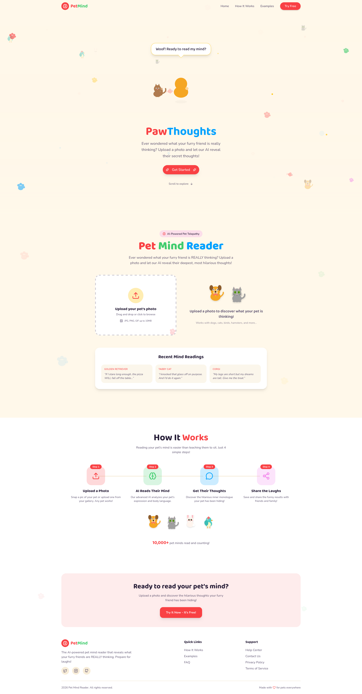

# Pet Mind Reader

Pet Mind Reader is a fun web app where you upload a pet photo and get what your pet is "thinking".

You can upload single pet photos for a single "thinking"  or multi pet photos for a conversation between the pets

#### The app is already live: https://pet-mind-reader.vercel.app/?_vercel_share=PONDkqP7qKzwGCFHfJSQo7b3dAymoN8M

## How Does The Project Works

The app:
- Allows to upload a pet image from your storage.
- Sends that image to a backend API route.
- Use Gemini to analyze the image and generate a response.
- Shows either:
    - A single thought for one pet
    - A conversation for multiple pets

## Image Upload Instructions

1. Open the app in your browser.
2. In the upload area:
    - Drag and drop a photo, or
    click the upload card and choose a file
3. Click the Read Their Mind button.
4. Wait for the result.

### Supported Formats
- `image/jpeg`
- `image/png`
- `image/gif`
- `image/webp`

### File size note
The limit of the image is 10MB

## Run Locally

### Prerequisites
- Node.js 20+ recommended
- npm
- A Google Gemini API key

## 

### 1. Install dependencies
```bash
npm install
```

### 2. Configure enviroment variables
Create .env.local in project root with:
```bash
npm GEMINI_API_KEY=your_gemini_api_key_here
```
### 3. Start the development server
```bash
npm run dev
```
### 4. Open in browser
Go to: http://localhost:3000
```bash
npm run build
npm run start
```
## Tech Stack
- Next.js
- React + TypeScript
- Tailwind CSS V4
- Framer Motion
- Google Generative AI SDK
- Lucide icons
- shadcn/ui components
